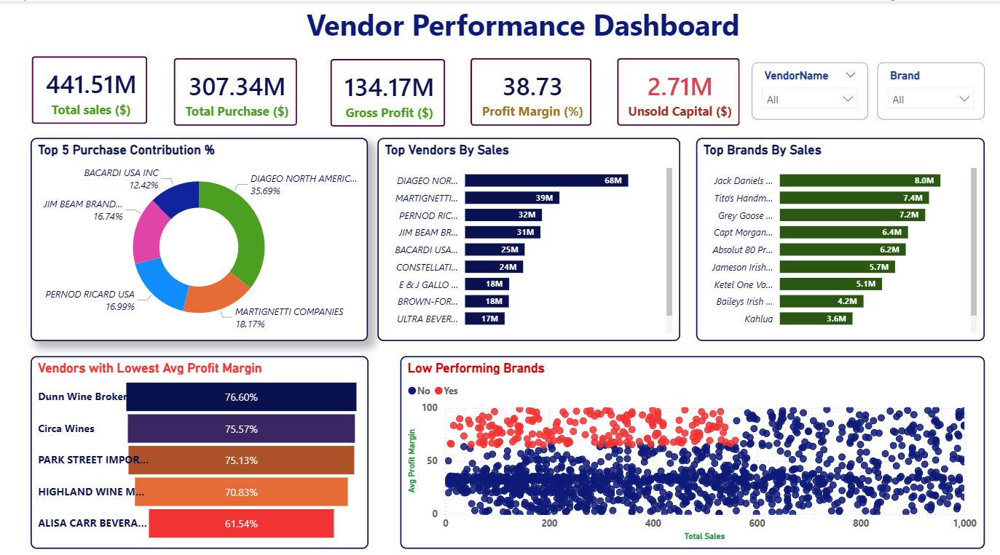

# 📊 Vendor Performance Analytics

> End-to-End Data Analytics Project using **Python, Power BI, and Statistical Testing** to optimize vendor performance, procurement efficiency, and inventory management.

---

## 📌 Project Overview

Vendor performance plays a crucial role in procurement and supply chain management. This project analyzes purchasing, sales, inventory, and profitability data to identify operational inefficiencies, vendor dependency, slow-moving inventory, and opportunities for cost optimization.

The complete workflow includes:

- Data Cleaning & Preprocessing
- Exploratory Data Analysis (EDA)
- Statistical Analysis
- Business Questions
- Interactive Power BI Dashboard
- Business Recommendations

---

## 🎯 Business Objectives

This project aims to answer the following business questions:

- Which vendors contribute the most to total purchases?
- Which brands require promotional or pricing adjustments?
- Does bulk purchasing significantly reduce procurement cost?
- Which vendors have slow-moving inventory?
- Is there a statistically significant difference in profit margins between top and low-performing vendors?
- What strategic actions can improve profitability?

---

# 🛠 Tech Stack

| Tool | Purpose |
|------|---------|
| Python | Data Cleaning, EDA & Statistical Analysis |
| Business Queries & KPI Analysis |
| Power BI | Interactive Dashboard |
| Pandas | Data Manipulation |
| NumPy | Numerical Computing |
| Matplotlib | Data Visualization |
| SciPy | Statistical Testing |
| Statsmodels | Confidence Interval Analysis |

---

# 📂 Repository Structure

```
Vendor-Performance-Data-Analysis/
│
├── analysis/
│   └── Vendor_Performance_Analysis.ipynb
│
├── dashboard/
│   ├── Vendor_Performance.pbix
│   └── dashboard.png
│
├── data/
│   ├── begin_inventory.csv
│   ├── end_inventory.csv
│   ├── purchase_prices.csv
│   ├── purchases.csv
│   ├── sales.csv
│   └── vendor_invoice.csv
│
├── images/
│   ├── dashboard.png
│   ├── Top 10 Vendor Purchase Contribution.png
│   └── correlation_heatmap.png
│
├── report/
│   └── Vendor_Performance_Report.pdf
│
├── requirements.txt
│
└── README.md
```

---

# 📈 Dashboard Preview



---

# 📊 Key Business Insights

### Vendor Contribution Analysis

- Top 10 vendors contribute approximately **65.7%** of total purchases.
- Heavy dependence on a small group of suppliers increases procurement risk.


---

### Inventory Insights

- Identified **₹2.71 Million** worth of unsold inventory.
- Low inventory turnover vendors were identified for inventory optimization.

---

### Pricing Strategy

- Identified **198 high-margin brands** with low sales.
- Promotional campaigns can increase sales without sacrificing profitability.

---

### Bulk Purchasing

- Large purchase orders reduce unit purchase cost by approximately **72%** compared to small orders.

---

### Statistical Validation

Performed statistical hypothesis testing to validate business assumptions.

- Confidence Interval Analysis
- Independent Sample T-Test
- Profit Margin Comparison

The statistical analysis confirmed a significant difference in profitability between top-performing and low-performing vendors.

---

# 📋 Power BI Dashboard KPIs

- Total Sales
- Total Purchase
- Gross Profit
- Profit Margin
- Unsold Capital
- Purchase Contribution
- Top Vendors
- Top Brands
- Low Performing Vendors
- Brand Performance Analysis

---

# 📄 Project Report

A detailed report containing:

- Business Problem
- Data Cleaning
- EDA
- Statistical Analysis
- SQL Findings
- Dashboard Insights
- Strategic Recommendations

is available in:

```
report/Vendor_Performance_Report.pdf
```

---

# 🚀 Getting Started

Clone the repository

```bash
git clone https://github.com/Abhijeet8382/Vendor-Performance-Data-Analysis.git
```

Install dependencies

```bash
pip install -r requirements.txt
```

Run the analysis notebook

```bash
jupyter notebook
```

---

# 📌 Business Recommendations

- Reduce supplier dependency by diversifying procurement.
- Promote high-margin brands with low sales volume.
- Consolidate purchase orders to maximize bulk discounts.
- Reduce capital blocked in slow-moving inventory.
- Continuously monitor vendor profitability using interactive dashboards.

---

# 👨‍💻 Author

**Abhijeet Singh**

- B.Tech Electrical Engineering
- National Institute of Technology Raipur
